## 24.09.26
### Транзакции

**BEGIN TRANSACTION**
```
BEGIN TRANSACTION;

SELECT COUNT(*) FROM AUDITORIUM;

INSERT INTO AUDITORIUM VALUES ('123-1', 'ЛК', 60, '123-1');

SELECT COUNT(*) FROM AUDITORIUM;

COMMIT;

SELECT COUNT(*) FROM AUDITORIUM;
```  

**ROLLBACK**
```
BEGIN TRANSACTION;

SELECT COUNT(*) FROM AUDITORIUM;

INSERT INTO AUDITORIUM VALUES ('124-1', 'ЛК', 60, '124-1');

SELECT COUNT(*) FROM AUDITORIUM;

ROLLBACK;

SELECT COUNT(*) FROM AUDITORIUM;
```

> Результат:
  

**SAVE TRANSACTION**
```
BEGIN TRANSACTION;

INSERT INTO AUDITORIUM VALUES ('999-1', 'ЛК', 60, '999-1');
SAVE TRANSACTION A;

INSERT INTO AUDITORIUM VALUES ('999-2', 'ЛК', 60, '999-2');
SAVE TRANSACTION B;

INSERT INTO AUDITORIUM VALUES ('999-3', 'ЛК', 60, '999-3');
ROLLBACK TRANSACTION B;

INSERT INTO AUDITORIUM VALUES ('999-4', 'ЛК', 60, '999-4');
ROLLBACK TRANSACTION A;

COMMIT TRANSACTION;

SELECT * FROM AUDITORIUM
WHERE AUDITORIUM IN('999-1', '999-2', '999-3', '999-4');
```

> Результат:
  

**TRANCOUNT**
```
-- Шаг 1: Транзакций нет (@@TRANCOUNT = 0)
SELECT COUNT(*) '1', @@TRANCOUNT 'TRANCOUNT' FROM AUDITORIUM;
BEGIN TRANSACTION A;

-- Шаг 2: Открыта первая транзакция (@@TRANCOUNT = 1)
INSERT INTO AUDITORIUM VALUES ('128-1', 'ЛК', 60, '128-1');
SELECT COUNT(*) '2', @@TRANCOUNT 'TRANCOUNT' FROM AUDITORIUM;

BEGIN TRANSACTION B;

-- Шаг 3: Открыта вложенная транзакция (@@TRANCOUNT = 2)
DELETE AUDITORIUM WHERE AUDITORIUM = '128-1';
SELECT COUNT(*) '3', @@TRANCOUNT 'TRANCOUNT' FROM AUDITORIUM;

COMMIT TRANSACTION B;

-- Шаг 4: Вложенная транзакция закрыта, но внешняя еще активна (@@TRANCOUNT = 1)
SELECT COUNT(*) '4', @@TRANCOUNT 'TRANCOUNT' FROM AUDITORIUM;

-- Шаг 5: Снова вставляем запись
INSERT INTO AUDITORIUM VALUES ('128-1', 'ЛК', 60, '128-1');
SELECT COUNT(*) '5', @@TRANCOUNT 'TRANCOUNT' FROM AUDITORIUM;

COMMIT TRANSACTION A;

-- Шаг 6: Все транзакции закрыты, данные зафиксированы (@@TRANCOUNT = 0)
SELECT COUNT(*) '6', @@TRANCOUNT 'TRANCOUNT' FROM AUDITORIUM;
```
> Результат:
  

**Блокировки**
```
SELECT resource_type,
DB_NAME(resource_database_id) as database_name,
request_session_id, request_mode,
request_status
FROM sys.dm_tran_locks;
```
> Результат:


**Взаимоблокировки**
#1
```
USE College;
GO

BEGIN TRANSACTION;
-- Блокируем первую аудиторию
UPDATE AUDITORIUM
	SET AUDITORIUM_CAPACITY = 70
	WHERE AUDITORIUM = '999-1';

-- ожидание
WAITFOR DELAY '00:00:10';

-- Пытаемся заблокировать вторую аудиторию
UPDATE AUDITORIUM
	SET AUDITORIUM_CAPACITY = 80
	WHERE AUDITORIUM = '999-2';
COMMIT;
```
#2
```
USE College;
GO

BEGIN TRANSACTION;
-- Блокируем вторую аудиторию
UPDATE AUDITORIUM
	SET AUDITORIUM_CAPACITY = 70
	WHERE AUDITORIUM = '999-2';

-- ожидание
WAITFOR DELAY '00:00:10';

-- Пытаемся заблокировать первую аудиторию
UPDATE AUDITORIUM
	SET AUDITORIUM_CAPACITY = 80
	WHERE AUDITORIUM = '999-1';
COMMIT;
```

> Результат:


## 25.09.2026
### Транзакции(снова)

## 25.09.26
### Транзакции

> Задача 1.1 — Зачисление студента на курс
> Студент записывается на курс. Необходимо:
> 1. Добавить запись в Enrollments.
> 2. Уменьшить доступное количество мест на курсе (добавьте столбец SeatsAvailable).
> 3. Если мест нет — вся операция откатывается.

```sql
DECLARE @StudentId INT = 1;
DECLARE @CourseId INT = 2; 
DECLARE @Semester NVARCHAR(20) = '2026-Осень';

BEGIN TRY
    BEGIN TRANSACTION;

    DECLARE @Available INT;
    -- проверка мест и блокировки строку от изменения другими транзакциями до конца нынешней
    SELECT @Available = SeatsAvailable 
    FROM Courses WITH (UPDLOCK) 
    WHERE CourseId = @CourseId;

    IF @Available <= 0
    BEGIN
        PRINT 'Нет доступных мест. Откат операции.';
        ROLLBACK TRANSACTION;
    END
    ELSE
    BEGIN
        -- ДОбавление записи о зачислении
        INSERT INTO Enrollments (StudentId, CourseId, Semester)
        VALUES (@StudentId, @CourseId, @Semester);

        -- Уменьшени кол-ва мест
        UPDATE Courses
        SET SeatsAvailable = SeatsAvailable - 1
        WHERE CourseId = @CourseId;

        COMMIT TRANSACTION;
        PRINT 'Студент успешно зачислен!';
    END
END TRY
BEGIN CATCH
    IF @@TRANCOUNT > 0 
        ROLLBACK TRANSACTION;
    PRINT 'Ошибка: ' + ERROR_MESSAGE();
END CATCH;
```
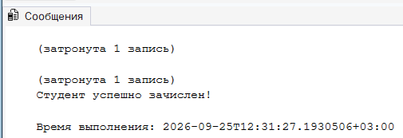


>Задача 1.2 — Перевод студента в другую группу

> Атомарно: изменить GroupId в Students и создать запись в AuditLog о переводе. Если лог не записался — перевод отменяется.

```sql
DECLARE @TransferStudentId INT = 2;
DECLARE @NewGroupId INT = 3;

BEGIN TRY
    BEGIN TRANSACTION;

    -- замена группы студенту
    UPDATE Students
    SET GroupId = @NewGroupId
    WHERE StudentId = @TransferStudentId;

    -- запись события в аудитлог
    INSERT INTO AuditLog (EventType, TableName, RecordId, Message)
    VALUES (
        'Transfer', 
        'Students', 
        @TransferStudentId, 
        'Студент переведен в группу ' + CAST(@NewGroupId AS NVARCHAR(10))
    );

    COMMIT TRANSACTION;
    PRINT 'Перевод выполнен, лог записан!';
END TRY
BEGIN CATCH
    -- При возникновении ошибки откатываем все
    IF @@TRANCOUNT > 0 
        ROLLBACK TRANSACTION;
    PRINT 'Сбой! Транзакция отменена. Причина: ' + ERROR_MESSAGE();
END CATCH;
```

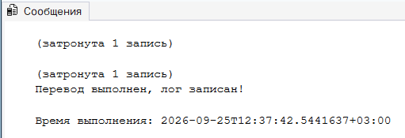

> Задача 1.3 — Мониторинг активных транзакций

> Найдите все активные транзакции в БД университета, работающие дольше 10 секунд: 

```sql
SELECT 
    st.session_id AS [ID Сессии],
    at.transaction_id AS [ID Транзакции],
    at.transaction_begin_time AS [Время начала],
    DATEDIFF(SECOND, at.transaction_begin_time, GETDATE()) AS [Длительность (сек)],
    DB_NAME(dt.database_id) AS [База данных]
FROM sys.dm_tran_active_transactions at
JOIN sys.dm_tran_session_transactions st ON at.transaction_id = st.transaction_id
JOIN sys.dm_tran_database_transactions dt ON at.transaction_id = dt.transaction_id
WHERE DATEDIFF(SECOND, at.transaction_begin_time, GETDATE()) > 10
  AND DB_NAME(dt.database_id) = 'College2';
```

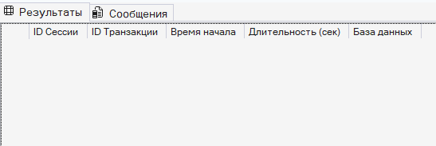

> Задача 2.1 (Atomicity — Атомарность)

> Сценарий: Выставление итоговой оценки студенту должно одновременно:
> * записать оценку в Grades;
> * обновить Enrollments.Status = 'Завершён'.
> Смоделируйте ошибку на втором шаге (например, через искусственный CHECK) и убедитесь, что оценка тоже не сохранилась.

```sql
USE College2;
GO

-- На всякий случай удаляем ограничение, если оно вдруг где-то зависло
IF EXISTS (SELECT * FROM sys.check_constraints WHERE name = 'CHK_SimulateError')
    ALTER TABLE Enrollments DROP CONSTRAINT CHK_SimulateError;
GO

-- искусственная ошибка
-- WITH NOCHECK заставляет SQL Server игнорировать старые записи и ругаться только на новые
ALTER TABLE Enrollments WITH NOCHECK ADD CONSTRAINT CHK_SimulateError CHECK (Status <> 'Завершён');
GO

-- 2. Запускаем транзакцию
BEGIN TRY
    BEGIN TRANSACTION;

    -- 1. Добавляем оценку
    INSERT INTO Grades (StudentId, CourseId, Grade)
    VALUES (1, 1, 5);
    
    PRINT 'Оценка добавлена в память транзакции.';

    -- 2. Пытаемся обновить статус
    UPDATE Enrollments
    SET Status = 'Завершён'
    WHERE StudentId = 1 AND CourseId = 1;

    COMMIT TRANSACTION;
    PRINT 'Операция успешна!';
END TRY
BEGIN CATCH
    -- 3 ошибка перехватывается, и происходит ролбэк
    IF @@TRANCOUNT > 0 
        ROLLBACK TRANSACTION;
    PRINT 'Произошла ошибка, транзакция отменена. Оценка не сохранилась!';
    PRINT ERROR_MESSAGE();
END CATCH;
GO

-- Проверяем, на отсутствие оценки(атомарность)
SELECT * FROM Grades WHERE StudentId = 1 AND CourseId = 1 AND Grade = 5;
GO

ALTER TABLE Enrollments DROP CONSTRAINT CHK_SimulateError;
GO
```
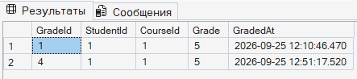


> Задача 2.2 (Consistency — Согласованность)
> Добавьте ограничение: студент не может быть записан на курс дважды в одном семестре.

```sql
ALTER TABLE Enrollments 
ADD CONSTRAINT UQ_Student_Course_Semester UNIQUE (StudentId, CourseId, Semester);
GO
```
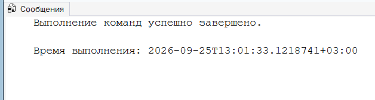

> Задача 2.3 (Isolation — Изолированность)
> Две сессии одновременно пытаются записать последнего студента на курс (мест = 1). Покажите, как без правильных блокировок могут записаться двое.

* Подготовка курса с одним свободным местов
```sql
UPDATE Courses SET SeatsAvailable = 1 WHERE CourseId = 1;
```
Чтобы увидеть проблему, нужно сделать 2 вкладки и запустить код одновременно:

#### Вкладка 1:
```sql
BEGIN TRAN;
DECLARE @Available INT;

-- Читаем: мест = 1. Блокировка чтения тут же снимается.
SELECT @Available = SeatsAvailable FROM Courses WHERE CourseId = 1;

-- Ждем 5 секунд (имитация долгого раздумья программы)
WAITFOR DELAY '00:00:05'; 

IF @Available > 0
BEGIN
    INSERT INTO Enrollments (StudentId, CourseId, Semester) VALUES (3, 1, '2026-Осень');
    UPDATE Courses SET SeatsAvailable = SeatsAvailable - 1 WHERE CourseId = 1;
    PRINT 'Студент 3 зачислен!';
END
COMMIT TRAN;
```

#### Вкладка 2
```sql
BEGIN TRAN;
DECLARE @Available INT;

-- Читаем: мест = 1, так как первая сессия еще не сделала UPDATE
SELECT @Available = SeatsAvailable FROM Courses WHERE CourseId = 1;

IF @Available > 0
BEGIN
    INSERT INTO Enrollments (StudentId, CourseId, Semester) VALUES (4, 1, '2026-Осень');
    UPDATE Courses SET SeatsAvailable = SeatsAvailable - 1 WHERE CourseId = 1;
    PRINT 'Студент 4 зачислен!';
END
COMMIT TRAN;
```

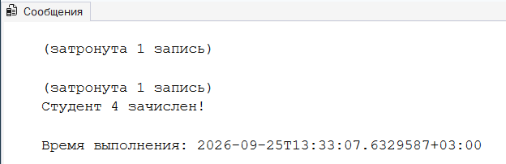


> Задача 2.4 (Durability — Надёжность)
> После COMMIT оценка студента сохраняется даже при перезапуске SQL Server. Объясните роль журнала транзакций (LDF) на примере.

* Надежность гарантирует, что если транзакция сообщила об успехе(выполнился COMMIT), данные никогда не потеряются, даже если в следующую секундку сервер обесточат. Это достигается благодаря механизму Write-Ahead Logging (WAL) и файлу журнала транзакций(.ldf)

**Пример:**
1. Преподаватель ставит оценку "4", код доходит до COMMIT.

2. В эту же миллисекунду SQL Server синхронно записывает эту операцию в файл журнала (LDF) на жестком диске. Журнал работает очень быстро, так как пишет данные строго последовательно.

3. Сама оценка "5" в главный файл данных (MDF) на диск еще не записалась. Она висит в оперативной памяти (в кэше).

4. Сервер обесточивается(допустим свет отрубили)

5. Сервер перезапускается. SQL Server запускает процесс восстановления (Recovery). Он читает .ldf файл, видит там зафиксированную транзакцию с отметкой COMMIT, берет из нее оценку "5" и накатывает ее (операция Redo) в физический файл MDF. Оценка спасена.


> Задача 3.1 — READ UNCOMMITTED (Грязное чтение)

> Сценарий: Деканат вносит новую оценку, но ещё не закоммитил. Студент смотрит свою ведомость и видит «2», хотя преподаватель передумал и откатит.
```sql
-- Session 1 (деканат)
BEGIN TRAN;
INSERT INTO Grades (StudentId, CourseId, Grade) VALUES (1, 10, 2);

-- пауза

-- Session 2 (студент)
SELECT * FROM Grades WITH (NOLOCK) WHERE StudentId = 1; -- увидит 2

-- Session 1
ROLLBACK; -- оценка исчезла, но студент её уже «увидел»
```
> Задание: воспроизвести, сделать вывод о рисках.

#### Вкладка 1
```sql
USE College2;
GO
BEGIN TRAN;
-- Преподаватель случайно ставит двойку
INSERT INTO Grades (StudentId, CourseId, Grade) VALUES (1, 1, 2);
-- ТРАНЗАКЦИЯ НЕ ЗАКРЫТА! Переходи во вкладку 2.
```
> 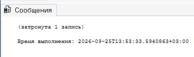

##### Вкладка 2
```sql
USE College2;
GO
-- Хинт WITH (NOLOCK) работает так же, как уровень изоляции READ UNCOMMITTED
SELECT * FROM Grades WITH (NOLOCK) WHERE StudentId = 1; 
-- Студент видит оценку 2 и паникует. Переходи обратно во вкладку 1.
```
> 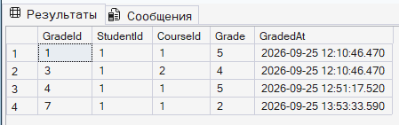

#### Вкладка 1
```sql
ROllBACK;
```

**ВЫВОДЫ:**
> Грязное чтение чревато фатальными ошибками в бизнес-логике. На основе «фантомной» двойки автоматическая система могла бы лишить студента стипендии или отправить приказ на отчисление, хотя в реальности этой оценки в базе никогда не существовало.

> Задача 3.2 — READ COMMITTED (Non-repeatable read)
> Сценарий: Студент дважды читает свою среднюю оценку во время сессии. Между чтениями преподаватель выставляет новую оценку.

```sql

-- Session 1

SET TRANSACTION ISOLATION LEVEL READ COMMITTED;
BEGIN TRAN;
SELECT AVG(Grade) FROM Grades WHERE StudentId = 1; -- например 4.0

```

> 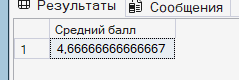

```sql
-- Session 2
INSERT INTO Grades VALUES (1, 11, 5); -- новая оценка
```

> 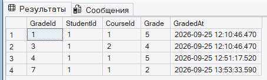

```sql
-- Session 1
SELECT AVG(Grade) FROM Grades WHERE StudentId = 1; -- уже 4.3

COMMIT;
```

> 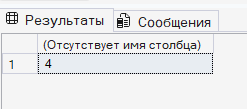


> Задача 3.3 — REPEATABLE READ (Phantom read)
> Сценарий: Деканат формирует список студентов группы ИС-21. Пока он читает, приходит перевод нового студента в эту группу.

```sql

SET TRANSACTION ISOLATION LEVEL REPEATABLE READ;
BEGIN TRAN;
SELECT COUNT(*) FROM Students WHERE GroupId = 5; -- 20
```
> 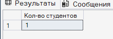


```sql
INSERT INTO Students (FullName, GroupId, EnrolledYear) VALUES (N'Новенький Н.Н.', 1, 2026);
```
> 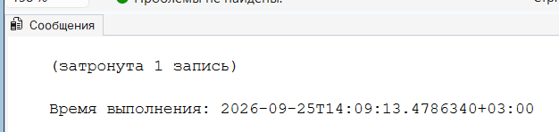

```sql
SELECT COUNT(*) FROM Students WHERE GroupId = 5; -- 21 → фантом
COMMIT;
```
> 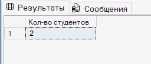


> Задача 3.4 — SERIALIZABLE
> Сценарий: Проверка, что в группе не больше 25 студентов. Запрос и вставка должны быть защищены от гонок.

#### Вкладка 1
```sql
SET TRANSACTION ISOLATION LEVEL SERIALIZABLE;
BEGIN TRAN;
-- SERIALIZABLE вешает блокировку диапазона ключей (Range Lock).
IF (SELECT COUNT(*) FROM Students WHERE GroupId = 2) < 25
    PRINT 'Места есть, начинаем оформление...';
```
> 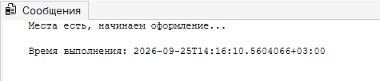

#### Вкладка 2
```sql
-- Этот запрос "зависнет" (уйдет в ожидание), потому что Сессия 1 заблокировала диапазон GroupId = 2.
INSERT INTO Students (FullName, GroupId, EnrolledYear) VALUES (N'Тестовый Т.Т.', 2, 2026);
```
> 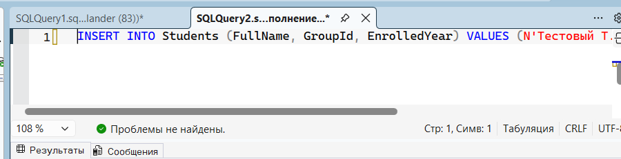

#### Вкладка 1
```sql
INSERT INTO Students (FullName, GroupId, EnrolledYear) VALUES (N'Первый П.П.', 2, 2026);
COMMIT;
```
> После выполнения запроса, запрос во второй вкладке отвис
>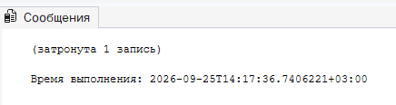

> Задача 3.5 — SNAPSHOT
> Отчёт по успеваемости факультета должен читаться согласованно, без блокировки текущих операций выставления оценок.

* Сначала нужно включить поддержку версионирования строк для базы:
```sql
ALTER DATABASE College2 SET ALLOW_SNAPSHOT_ISOLATION ON;
GO
```

#### Вкладка 1
```sql
SET TRANSACTION ISOLATION LEVEL SNAPSHOT;
BEGIN TRAN;
-- Аналитик читает согласованный срез данных на момент старта транзакции. 
-- Чтение не накладывает блокировки (S-locks).
SELECT * FROM Grades g JOIN Students s ON g.StudentId = s.StudentId;
```
> 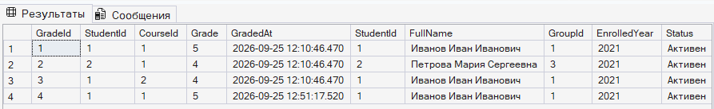

#### Вкладка 2
```sql
-- Запрос выполнится мгновенно, не ожидая аналитика, так как блокировок нет.
INSERT INTO Grades (StudentId, CourseId, Grade) VALUES (2, 1, 4);
```
> 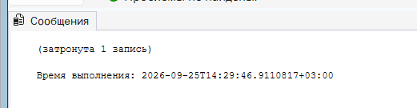

#### Вкладка 1
```sql
COMMIT;
```
> 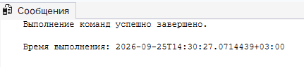

> Задача 3.6 — Сравнение уровней изоляции

| Операция | Рекомендуемый уровень | Обоснование |
| :--- | :--- | :--- |
| **Чтение ведомости студентом** | `READ COMMITTED` | Достаточно видеть только зафиксированные данные. Если нужно, чтобы чтение ведомостей (сотни студентов) не блокировало работу преподавателей, идеально подойдет `SNAPSHOT` (если включен в БД). |
| **Выставление оценки** | `READ COMMITTED` | Стандартная запись. Блокировки конкретной строки (Row Lock) достаточно, чтобы две сессии не мешали друг другу. |
| **Формирование расписания сессии** | `SERIALIZABLE` | Необходимо защититься от фантомных вставок, чтобы два разных диспетчера параллельно не поставили два экзамена в одну и ту же аудиторию в одно и то же время. |
| **Расчёт стипендии** | `SNAPSHOT` или `REPEATABLE READ` | Финансовые расчеты требуют строгой консистентности. Пока идет расчет средних баллов по всему потоку, ни одна оценка не должна измениться (защита от неповторяющегося чтения). `SNAPSHOT` предпочтительнее, так как не заблокирует базу для других пользователей на время расчета. |

> Задача 4.1 — Анализ блокировок текущей сессии

```sql
USE College2;
GO

BEGIN TRAN;

-- 1 Обновляем оценку (вешаем блокировку)
UPDATE Grades 
SET Grade = 4 
WHERE StudentId = 1 AND CourseId = 1;

-- 2 Смотрим, какие блокировки выдал нам SQL Server
SELECT 
    request_session_id AS [ID сессии], 
    resource_type AS [Уровень блокировки], 
    resource_description AS [Описание ресурса],
    request_mode AS [Тип блокировки (Mode)], 
    request_status AS [Статус]
FROM sys.dm_tran_locks
WHERE request_session_id = @@SPID;

-- 3 Откатываем транзакцию, чтобы снять блокировки
ROLLBACK;
```
> 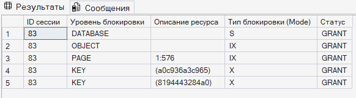

> P.S. Не успел дальше
